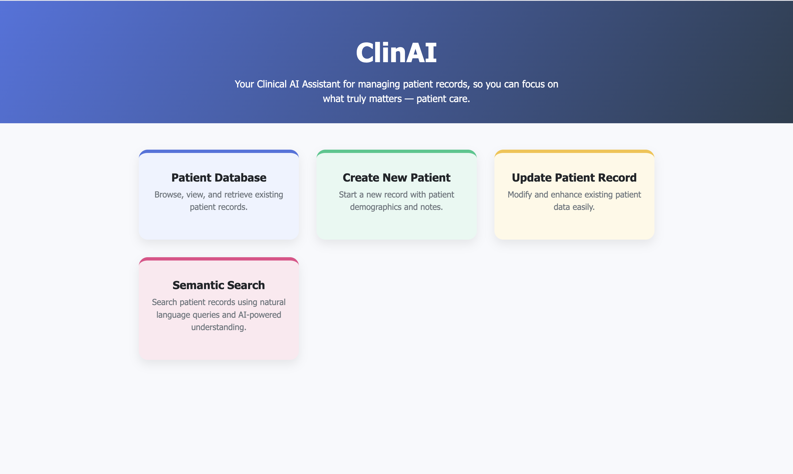

# clinai-agent

## Introduction
Meet ClinAI - your intelligent clinical assistant that revolutionizes patient record management through the power of artificial intelligence. Built with cutting-edge technology including Gemini AI and advanced voice recognition, ClinAI transforms how healthcare professionals capture, process, and retrieve patient information. Simply record doctor-patient conversations, and watch as our AI automatically extracts demographics, generates clinical summaries, creates interactive timelines, identifies key medical terms, and manages prescriptions - all while providing an intuitive editing interface for healthcare providers. With features like semantic search that understands natural language queries such as 'find patients with diabetes medications,' ClinAI empowers doctors to spend less time on documentation and more time on what truly matters - patient care. This comprehensive solution seamlessly integrates voice-to-text transcription, AI-powered medical data extraction, and intelligent search capabilities into one elegant platform designed specifically for modern healthcare workflows.

## Video

## Tech used

Gemini API - [Link](https://ai.google.dev/)
MCP - [Link](https://modelcontextprotocol.io/introduction)
Vanilla Js
FastAPI - [Link](https://fastapi.tiangolo.com/)

# Features

1) Intelligent patient record documentation using just doctor patient conversation.
2) Patient lookup and event timelines using reactive dashboards and Agentic tools.
3) Semantic search for reverse lookups and easy patient information access using historical context (LLM based retrieval and ranking)
